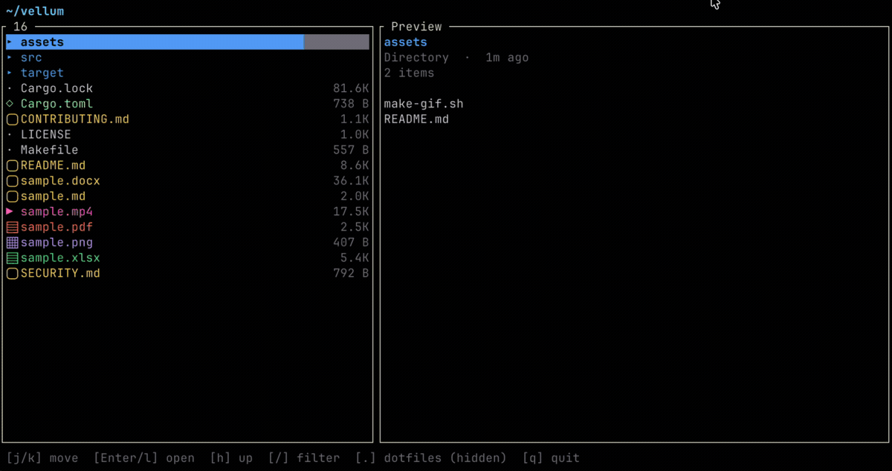
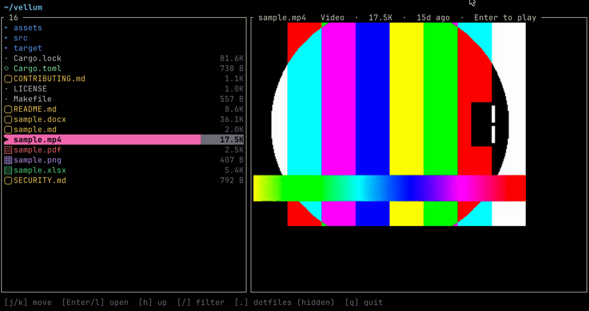
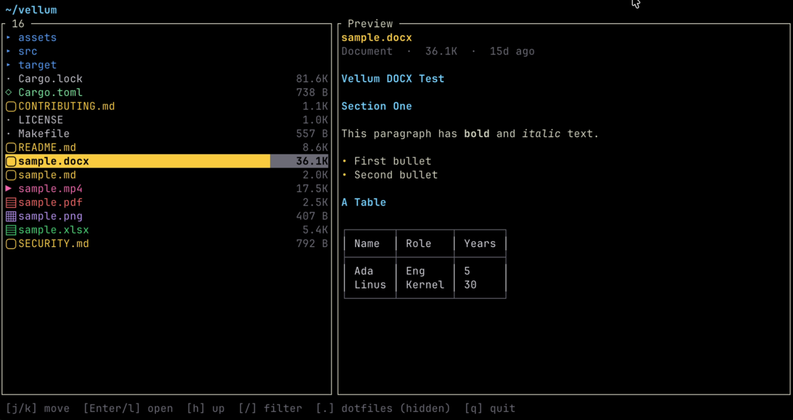
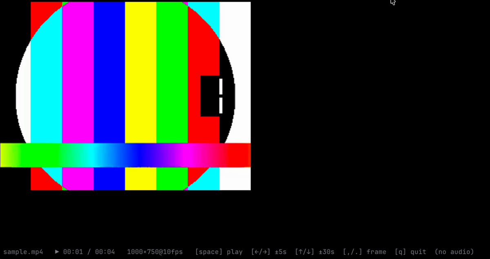

# vellum

> Fast terminal viewer **and directory browser** for markdown, spreadsheets,
> PDF, images, video, and Word docs — with real pixels in the terminal.

[](https://github.com/john-athan/vellum/actions/workflows/ci.yml)
[](LICENSE)
[](https://www.rust-lang.org)
[](https://ratatui.rs)

A fast terminal viewer for the files that are awkward to open in a browser —
**markdown, spreadsheets, PDF, images, video, and Word documents** — behind one
tiny command:

```sh
v report.md
v data.xlsx
v paper.pdf
v photo.jpg
v clip.mp4
v contract.docx
v ~/projects        # or a directory — browse and open files in place
v                   # no argument: browse the current directory
```

*Vellum* is the fine parchment that manuscripts were written on — the surface you
read off of. The tool picks a viewer by file extension and renders it in place,
using your terminal's graphics protocol for real pixels where one is available.

## Demo

<!-- Capture in a graphics terminal, then commit assets/. See assets/README.md. -->


| Directory browser | Markdown & docs | Video & images |
| :---: | :---: | :---: |
|  |  |  |

---

## Highlights

- **One launcher, many formats** — dispatch by extension, sensible TUI per type.
- **Directory browser** — point `v` at a folder (or run it bare) for a fast,
  two-pane navigator: live preview pane, fuzzy filter, and `Enter` opens the
  selection in its viewer, then drops you back where you were.
- **Handles huge files** — a 240 MB / 800k-row spreadsheet opens in ~160 ms and
  stays scrollable, because sheets stream in on a background thread instead of
  being loaded whole.
- **Real graphics** — images, PDF pages, and video frames render as actual
  pixels via the kitty / iTerm2 / sixel protocols (with a Unicode half-block
  fallback), through [`ratatui-image`](https://crates.io/crates/ratatui-image).
- **Real typography in pipe mode** — `v --plain doc.md` emits the kitty
  text-sizing protocol so headings render *larger* on supporting terminals;
  detected at runtime, with graceful fallback.
- **Responsive** — event-driven redraw (no idle CPU churn) and background work
  for the expensive bits.

## Supported formats

| Category | Extensions | Backend |
|----------|-----------|---------|
| Markdown | `.md`, and the default for unknown text | [`pulldown-cmark`](https://crates.io/crates/pulldown-cmark) |
| Spreadsheet | `.xlsx`, `.xlsm` | streaming reader (zip + quick-xml) on a worker thread |
| Spreadsheet | `.xls`, `.ods`, `.xlsb` | [`calamine`](https://crates.io/crates/calamine) (eager) |
| PDF | `.pdf` | poppler `pdftocairo` → graphics |
| Image | `.png` `.jpg` `.jpeg` `.gif` `.webp` `.bmp` `.tiff` `.ico` | [`image`](https://crates.io/crates/image) → graphics |
| Video | `.mp4` `.mov` `.mkv` `.webm` `.avi` `.m4v` | streaming `ffmpeg` pipe → graphics |
| Word | `.docx` | unzip + streaming XML → markdown renderer |
| Directory | any folder | two-pane file browser (list + live preview) |

When stdout is not a TTY (piped), vellum prints a sensible text dump instead of
launching the TUI (`pdftotext` for PDF, TSV for sheets, metadata for video,
styled text for markdown/docx, a plain listing for directories).

## Install

Requires a recent **Rust** toolchain.

```sh
# Quickest — installs the `vellum` binary into ~/.cargo/bin:
cargo install --git https://github.com/john-athan/vellum
```

Or clone for the short `v` alias and `make` targets:

```sh
git clone https://github.com/john-athan/vellum
cd vellum
make install        # builds --release, installs `vellum`, symlinks `v`
```

`make install` puts the binary in `~/.cargo/bin` and creates a short `v`
symlink next to it. (`make uninstall` removes both.)

### Optional runtime dependencies

These are only needed for the formats that shell out to them:

| For | Needs | macOS |
|-----|-------|-------|
| PDF | poppler (`pdftocairo`, `pdfinfo`, `pdftotext`) | `brew install poppler` |
| Video | `ffmpeg`, `ffprobe` | `brew install ffmpeg` |

For pixel-perfect images / PDF / video, use a terminal with a graphics
protocol — **kitty, ghostty, WezTerm, iTerm2**, or any sixel-capable terminal.
Without one, vellum falls back to Unicode half-blocks.

## Usage & keys

```sh
v <file>            # interactive viewer (TTY)
v <dir>  /  v       # directory browser (bare `v` = current dir)
v --plain <file>    # one-shot styled dump to stdout
v <file> | less     # piped: text dump
```

**Directory** — `j`/`k` `↑`/`↓` move · `d`/`u` half-page · `g`/`G` top/bottom ·
`Enter`/`l`/`→` open file or enter folder · `h`/`←`/`Backspace` parent ·
`/` fuzzy filter · `.` toggle dotfiles · `q` quit. The right pane renders a live
preview of the selection: **images, PDFs (page 1), and video posters as real
pixels**, **markdown/docx with full typography**, child listing for folders, and
the head of the file for text/code. Previews are cached as you move.

**Markdown** — `j`/`k` `↑`/`↓` scroll · `d`/`u` half-page · `g`/`G` top/bottom ·
`t` table of contents · `/` search (`n`/`N` next/prev) · `l` link picker ·
`?` help · `q` quit.

**Spreadsheet** — `h`/`j`/`k`/`l` or arrows move cell · `PgUp`/`PgDn` ·
`g`/`G` top/bottom · `Tab` / `[` `]` switch sheet · `/` search all cells
(`n`/`N` cycle) · `q` quit. Status bar shows the cell ref, value, and load
progress.

**PDF** — `j`/`k`, `←`/`→`, or `space` page · `g`/`G` first/last · `q` quit.
Visited pages are cached.

**Image** — `q` quit.

**Video** — auto-plays on open · `space` play/pause · `←`/`→` ±5 s ·
`↑`/`↓` ±30 s · `,`/`.` frame step · `g`/`G` start/end · `q` quit. No audio.

## How it works

```
main.rs        dispatch by extension; TTY → TUI, pipe → text dump
dir.rs         directory browser (list + live preview), opens files via main
markdown.rs    parse → logical lines + TOC + links; width-aware wrap/layout
tui.rs         markdown TUI (scroll / TOC / search / links)
plain.rs       one-shot markdown renderer (kitty text-sizing in pipe mode)
sheet.rs       grid UI over a `Book` (streaming xlsx, or eager calamine)
xlsx.rs        background streaming .xlsx reader (zip + quick-xml), capped
pdf.rs         poppler page raster + page cache, sized to the display
imgview.rs     image viewer
video.rs       streaming ffmpeg pipe + background decoder, paced w/ frame-drop
docx.rs        .docx → markdown (reuses the markdown renderer)
media.rs       shared graphics pane (ratatui-image protocol probe + render)
```

Design notes:

- **Spreadsheets stream.** Only the current sheet is held in memory; rows are
  parsed incrementally on a worker thread and the grid reads them live, so
  opening is independent of total file size. Switching sheets frees the
  previous one. A row cap bounds pathological files.
- **PDF renders to display size** (`pdftocairo -scale-to-x <terminal px>`)
  rather than a fixed DPI, and caches rendered pages.
- **Video** drives a single long-lived `ffmpeg` process emitting raw frames; a
  decoder thread paces to real time and keeps only the latest frame, so a slow
  terminal drops frames instead of falling behind. Effective frame rate is
  bounded by how fast the terminal can transmit images, not by decoding.

## Development

```sh
make build      # cargo build --release
make run        # cargo run -- sample.md
cargo test      # unit tests (markdown layout, docx conversion, xlsx search)
```

A large-workbook benchmark is included but ignored by default:

```sh
VELLUM_BIG=/path/to/big.xlsx cargo test --release big_xlsx -- --ignored --nocapture
```

## Limitations

- DOCX keeps headings, bold/italic, lists, and tables; images, headers/footers,
  and exact styling are dropped.
- Spreadsheet dates show as serial numbers (style table isn't read); the
  streaming reader caps very large sheets.
- Video has no audio, and terminal frame rate is capped by image transmission.
- Inside the full-screen TUI, markdown headings use color/bold (not the
  text-sizing protocol — that applies to `--plain` / pipe output).
- In the directory browser, previews render synchronously as you move the
  selection, so a PDF or video poster adds a brief raster pause on first visit
  (cached afterward). Video shows a poster frame, not playback — press `Enter`
  to open the full player.

## License

MIT — see [LICENSE](LICENSE).
